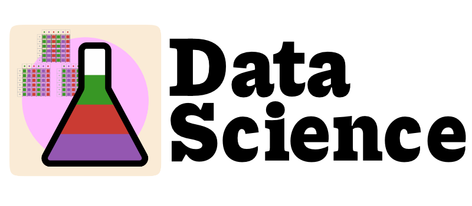

# Julia Academy Data Sciences in `Pluto.jl`



This project is my write-up of the Julia Academy Data Sciences Course ([website](https://juliaacademy.com/p/julia-for-data-science)). The original Jupyter notebooks are found on the official [github repo](https://github.com/JuliaAcademy/DataScience).

My write-ups of the notebooks are in `Pluto.jl`. Some notebooks utilise the inbuilt package management within Pluto, others make use of a local environment (using `Project.toml`). 

## Quick installation

Run Julia as project in current directory

```sh
julia --project=.
```

Load project.toml

```julia
] activate .
] instantiate
```

Install and load Pluto

```julia
] add Pluto
using Pluto
Pluto.run()
```

## Notebooks

1. Introduction to loading, reading, saving data from/into various formats. Downloading data.
2. Linear Algebra. Tools for working with Arrays, in particular Matrices. Factorisation, decomposition, sparse matrices, images, solving `Ax=b`.
3. Basic statistics. Distributions, plotting, kernel density, sampling, fitting, hypothesis testing, correlations.
4. Dimension reduction. PCA, t-SNE, UMAP. Reducing dimensionality of data to find variables of significance, project data onto 2 or 3 dimensions for visualisation.
5. Clustering. Hclist, K-means, K-medoids. Grouping similar data.
6. Classificaiton. Modelling categorical data, predicting which class a set of observations might fall into. Using Iris Dataset. Splitting data into training and testing. Lasso, ridge regression & elastic net, decision trees & random forest, nearest neighbours, and support vector machines.
7. Regression. Linear regression, generalised linear models, non-linear fitting. Minimum least square error. 
8. Graphs. Map plotting, building graphs from adjacency matrices. Graph analysis including degree distribution, shortest distance, spanning trees, node importance measurements, clustering.
9. Optimisation. Finding solution to a problem given a set of constraints. Min/maxing optimisation problems. Convex problems, `JuMP` optimisation.
10. Neural Networks. Basics of neural networks, training neural networks. Setting up training and testing data.
11. Other languages. Calling functions from R, python, and C. 
12. Visualisation. Various plot types: violin, barplots/histograms, line plots, ribbon/band plots, scatter plots.

## Main Differences with official course

Where possible I have used a fully Julia solution, for example `GLMNet.jl` is a wrapper for a fortran library. `Lasso.jl` is a pure Julia version of `GLMNet`.

* I have used `Pluto.jl` rather than Jupyter notebooks.
* I used `Makie` (specifically `CairoMakie.jl`) in place of the standard `Plots.jl`.
* `Lasso.jl` instead of `GLMNet.jl` for Lasso and Ridge regressions in notebook 6.
